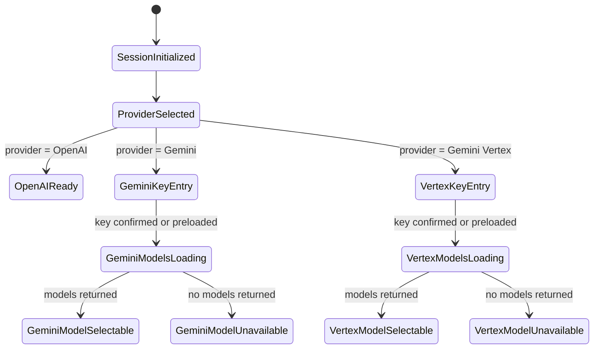
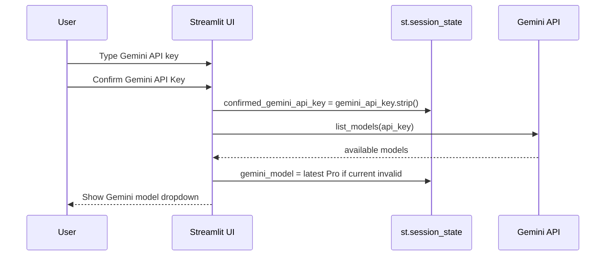
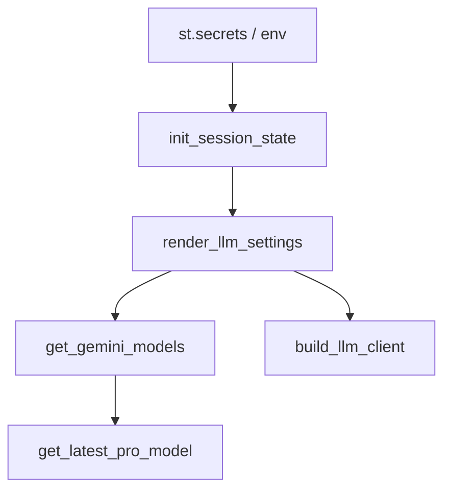

# LLM Selection Workflow

This document describes the current provider and model selection workflow in [app.py](app.py).

It is intended to be a **behavioral baseline** for automated tests.

## Scope

Covered here:
- session-state initialization
- secrets and environment fallback
- provider selection
- OpenAI model selection
- Gemini key confirmation semantics
- Gemini model discovery
- Gemini Vertex model discovery
- client construction prerequisites

Not covered here:
- repository loading after URL submission
- question analysis flow
- chat history rendering

---

## 1. Key idea: what “confirmation” means

There is **no separate confirmed Gemini model**.

The confirmation concept applies only to the **Gemini API key**.

In practical terms, the current desired behavior is:

1. the user updates `gemini_api_key`, and
2. that key is immediately used to request the available Gemini model list.

So the workflow is:

- user enters a Gemini key
- app uses that key for model discovery
- app calls Gemini model listing with that key
- if models are returned, the dropdown becomes available

That means there is no separate confirmation variable in the intended workflow.

---

## 2. Relevant functions and what each one does

### `parse_github_url(url)`
Parses a GitHub repository URL and returns `(owner, repo)`.

Used by the repository-loading section, not by LLM selection directly.

### `get_streamlit_secret(key, default='')`
Reads a configuration value from Streamlit secrets.

Lookup order inside the function:
1. `st.secrets["llm"][key]`
2. `st.secrets[key]`
3. provided default

Purpose:
- centralize secrets lookup
- allow both nested and top-level secrets

### `get_gemini_models(api_key)`
Uses the Gemini API to retrieve available models.

Responsibilities:
- return `[]` when the key is blank
- configure Gemini with the key
- call `genai.list_models()`
- filter to models usable for `generateContent`
- keep only `models/gemini...`
- normalize names by removing `models/`
- return a descending-sorted unique list

Purpose:
- avoid hardcoded Gemini model guesses
- make the UI depend on actual API availability

### `get_latest_pro_model(models)`
Chooses the best default Gemini model from a discovered list.

Responsibilities:
- filter models containing `pro`
- sort them by extracted numeric parts in descending order
- return the highest-ranked Pro model
- if there is no Pro model, return the first available model
- if list is empty, return `''`

Purpose:
- preserve the “default to latest Pro” behavior

### `init_session_state()`
Initializes the Streamlit session state keys required by the app.

Responsibilities:
- set defaults only when keys are missing
- load defaults from secrets first
- fall back to environment variables and then literals

Important keys for this workflow:
- `provider`
- `openai_model`
- `gemini_model`
- `gemini_vertex_model`
- `openai_api_key`
- `gemini_api_key`
- `gemini_vertex_project`
- `gemini_vertex_location`

### `get_active_model()`
Returns the currently selected model for the active provider.

Purpose:
- drive UI summaries such as the active provider/model caption

### `get_llm_signature()`
Builds a tuple representing the current effective LLM configuration.

Purpose:
- detect meaningful provider/model/config changes
- decide when to reset conversation state

### `reset_conversation()`
Clears:
- `conversation_messages`
- `chat_history`

Purpose:
- avoid carrying old chat state across provider/config changes

### `build_llm_client()`
Constructs the actual LLM client instance for the active provider.

Responsibilities:
- validate required credentials/config
- build `OpenAIClient`, `GeminiClient`, or `GeminiVertexClient`

Important current behavior:
- Gemini client creation uses `gemini_api_key`
- Gemini model discovery should also use `gemini_api_key`

### `render_llm_settings()`
Renders the sidebar controls and drives model discovery.

Responsibilities:
- render provider selector
- render provider-specific credential inputs
- load Gemini models whenever `gemini_api_key` is updated or preloaded
- show the model dropdown only when model discovery succeeds
- auto-select the latest Pro model when needed

This is the main workflow function for the feature.

### `main()`
Top-level Streamlit entry point.

For this workflow, it does two relevant things before repository loading:
1. calls `init_session_state()`
2. calls `render_llm_settings()`

---

## 3. Configuration sources

Defaults are loaded in this order:

1. `st.secrets["llm"][...]`
2. top-level `st.secrets[...]`
3. `os.getenv(...)`
4. hardcoded fallback values

Values currently sourced this way:

- `provider`
- `openai_model`
- `gemini_model`
- `gemini_vertex_model`
- `OPENAI_API_KEY`
- `GEMINI_API_KEY`
- `GOOGLE_CLOUD_PROJECT`
- `GOOGLE_CLOUD_LOCATION`

---

## 4. Session-state model for this workflow

### Input state
- `provider`
- `openai_api_key`
- `gemini_api_key`
- `gemini_vertex_project`
- `gemini_vertex_location`

### Derived or committed state
- `openai_model`
- `gemini_model`
- `gemini_vertex_model`
- `active_llm_signature`

---

## 5. Current workflow by provider

## 5.1 OpenAI

Rendered controls:
- provider dropdown
- OpenAI model dropdown
- OpenAI API key password field

Behavior:
- model list is static
- no API discovery step
- `build_llm_client()` fails if the key is blank

---

## 5.2 Gemini

Rendered controls:
- provider dropdown
- Gemini API key password field
- model dropdown only after successful model discovery

Workflow:

1. user types `gemini_api_key`
2. app calls `get_gemini_models(gemini_api_key.strip())`
5. if models are returned:
  - ensure `gemini_model` is valid
  - otherwise replace it with `get_latest_pro_model(models)`
  - render dropdown
6. if no models are returned:
  - show an explanatory caption

Special case:
- if the Gemini key was initialized from secrets, the app should proceed directly to discovery and dropdown rendering

---

## 5.3 Gemini Vertex

Rendered controls:
- provider dropdown
- Gemini API key password field used only for model discovery
- Google Cloud project field
- Vertex location field
- model dropdown only after successful model discovery

Workflow:

1. user provides discovery key in `gemini_api_key`
2. app calls `get_gemini_models(gemini_api_key.strip())`
5. if models are returned:
  - ensure `gemini_vertex_model` is valid
  - otherwise replace it with the latest Pro model
  - render dropdown
6. `build_llm_client()` later creates `GeminiVertexClient` using:
  - `gemini_vertex_model`
  - `gemini_vertex_project`
  - `gemini_vertex_location`

Important note:
- current Vertex model discovery is still based on Gemini API listing, not a Vertex-native model listing endpoint

---

## 6. UML-style formalization

Yes — Mermaid is a good fit here.

## 6.1 State diagram



## 6.2 Sequence diagram for Gemini



## 6.3 Component view



---

## 7. Current pain points

These are the fragile areas that should drive the tests:

1. model loading is tightly coupled to sidebar render timing
2. secrets-loaded keys should immediately trigger discovery
3. Vertex discovery is not Vertex-native
4. Streamlit rerun behavior can hide whether model loading actually refreshed

---

## 8. Automated test plan

The goal is to test the workflow in layers.

## 8.1 Test strategy

### Layer 1: pure function tests
Fast unit tests for deterministic helpers.

Functions:
- `get_streamlit_secret()`
- `get_latest_pro_model()`

### Layer 2: Gemini API adapter tests
Unit tests for `get_gemini_models()` using mocks.

Mock:
- `genai.configure`
- `genai.list_models`

### Layer 3: session-state initialization tests
Unit tests for `init_session_state()`.

Mock:
- `st.secrets`
- `os.getenv`
- `st.session_state`

### Layer 4: UI workflow tests
Behavioral tests around `render_llm_settings()`.

Mock:
- `st.sidebar`
- `st.selectbox`
- `st.text_input`
- `st.button`
- `st.caption`
- `st.session_state`
- `get_gemini_models()`

### Layer 5: client-construction tests
Unit tests for `build_llm_client()`.

Mock:
- `OpenAI`
- `OpenAIClient`
- `GeminiClient`
- `GeminiVertexClient`

---

## 8.2 Proposed test cases

### A. Secrets and defaults
1. nested `st.secrets["llm"]` overrides top-level secrets
2. top-level secrets override environment variables
3. missing secrets fall back to env/defaults
4. `gemini_api_key` is initialized from secrets/env when available

### B. Gemini model discovery
5. blank key returns empty model list
6. non-Gemini models are filtered out
7. models without `generateContent` are filtered out
8. normalized model names remove `models/`

### C. Latest Pro selection
9. newest numeric Pro model is selected
10. if no Pro model exists, first model is selected
11. empty list returns empty string

### D. Gemini UI behavior
12. with no Gemini key, no model dropdown is shown
13. after key update and successful discovery, model dropdown is shown
14. when selected model is absent from discovered list, latest Pro is auto-selected
15. when a secrets-loaded Gemini key exists, dropdown appears without manual confirmation

### E. Gemini Vertex UI behavior
17. Vertex provider shows project and location fields
18. current `gemini_api_key` is used for Vertex model discovery
19. Vertex latest-Pro auto-selection works the same way

### F. Client construction
20. OpenAI client creation fails without key
21. Gemini client creation fails without key
22. Vertex client creation fails without project
23. each provider constructs the correct client type

---

## 8.3 Suggested test tooling

Recommended stack:
- `pytest`
- `pytest-mock` or `monkeypatch`

Optional later:
- Streamlit app testing helpers, if needed for higher-level interaction tests

---

## 8.4 Suggested test file layout

```text
tests/
  test_llm_selection_helpers.py
  test_llm_selection_state.py
  test_llm_selection_ui.py
  test_llm_client_building.py
```

### Suggested ownership
- helper tests: pure functions
- state tests: `init_session_state()`
- UI tests: `render_llm_settings()`
- client tests: `build_llm_client()`

---

## 8.5 First implementation milestone

The smallest useful first batch of tests is:

1. `get_streamlit_secret()` precedence
2. `get_gemini_models()` filtering and normalization
3. `get_latest_pro_model()` selection logic
4. `init_session_state()` secrets initialization
5. `render_llm_settings()` with secrets-loaded Gemini key shows model dropdown immediately
6. `render_llm_settings()` with no Gemini key does not show model dropdown
7. `render_llm_settings()` key update path shows dropdown when models exist

---

## 9. Summary

The current workflow is best described as:

- choose provider
- load defaults from secrets/env
- for Gemini flows, use the current Gemini key for model discovery
- discover models from the Gemini API
- default to the latest available Pro model
- build the final client only when analysis is requested

This document should be used as the contract for the first automated test pass.
# LLM Selection Workflow

This document describes the current Streamlit workflow in `app.py` for provider selection, credential loading, Gemini key confirmation, and model selection.

It is intentionally descriptive of the current implementation so it can be used as a baseline for automated tests.

## Scope

Covered here:
- initial session state
- loading defaults from Streamlit secrets and environment variables
- provider selection
- OpenAI model selection
- Gemini API key confirmation flow
- Gemini model discovery flow
- Gemini Vertex model discovery flow

Not covered here:
- repository loading after URL submission
- question analysis flow
- chat history rendering

---

## 1. Relevant functions

The workflow currently depends on these functions in `app.py`:

- `get_streamlit_secret()`
- `get_gemini_models()`
- `get_latest_pro_model()`
- `init_session_state()`
- `get_active_model()`
- `get_llm_signature()`
- `build_llm_client()`
- `render_llm_settings()`

---

## 2. Data sources for defaults

Defaults are loaded in this order:

1. `st.secrets["llm"][...]` when present
2. top-level `st.secrets[...]` when present
3. environment variables via `os.getenv(...)`
4. hardcoded fallback values in `init_session_state()`

### Values currently read from secrets/env

- `provider`
- `openai_model`
- `gemini_model`
- `gemini_vertex_model`
- `OPENAI_API_KEY`
- `GEMINI_API_KEY`
- `GOOGLE_CLOUD_PROJECT`
- `GOOGLE_CLOUD_LOCATION`

---

## 3. Session state keys involved in provider/model selection

`init_session_state()` initializes these keys if they do not already exist:

- `repo_files`
- `llm_client`
- `conversation_messages`
- `chat_history`
- `provider`
- `openai_model`
- `gemini_model`
- `gemini_vertex_model`
- `openai_api_key`
- `gemini_api_key`
- `confirmed_gemini_api_key`
- `gemini_vertex_project`
- `gemini_vertex_location`
- `active_llm_signature`

### Important distinction

There are two Gemini-key-related values:

- `gemini_api_key`: current value shown/edited in the sidebar input
- `confirmed_gemini_api_key`: value actually used to query Gemini models

---

## 4. Sidebar entry point

`main()` calls:

1. `init_session_state()`
2. `render_llm_settings()`

So the LLM settings sidebar is rendered before repository loading.

---

## 5. Provider selection flow

The sidebar always renders:

- `Provider` selectbox with three values:
  - `OpenAI`
  - `Gemini`
  - `Gemini Vertex`

The selected provider drives which input controls are rendered next.

---

## 6. OpenAI flow

When provider is `OpenAI`:

### Rendered controls
- model dropdown from `PROVIDER_MODELS["OpenAI"]`
- password field for `openai_api_key`

### Build behavior
`build_llm_client()`:
- validates `openai_api_key`
- raises `ValueError` if blank
- creates `OpenAI(api_key=...)`
- wraps it in `OpenAIClient`

### Notes
OpenAI model selection is static. No API discovery is performed.

---

## 7. Gemini flow

When provider is `Gemini`:

### Rendered controls
- password field for `gemini_api_key`
- `Confirm Gemini API Key` button
- model area, which is conditional

### Confirmation step
When the button is pressed, enter is pressed inside the `gemini_api_key` text box or the `gemini_api_key` loses focus:

- `confirmed_gemini_api_key = gemini_api_key.strip()`

### Model loading step
After that, `render_llm_settings()` computes:

- `confirmed_gemini_api_key = st.session_state.confirmed_gemini_api_key.strip()`
- `gemini_models = get_gemini_models(confirmed_gemini_api_key)`
- `latest_pro_model = get_latest_pro_model(gemini_models)`

### Gemini model discovery
`get_gemini_models(api_key)`:

1. returns `[]` if key is blank
2. calls `genai.configure(api_key=api_key)`
3. calls `genai.list_models()`
4. filters models where:
   - `generateContent` is in `supported_generation_methods`
   - name starts with `models/gemini`
5. strips the `models/` prefix
6. sorts descending

### Gemini model selection UI
If `gemini_models` is non-empty:

- if `gemini_model` is not in the returned list, it is replaced with `latest_pro_model`
- a selectbox is shown with the discovered models

If `gemini_models` is empty:

- if `confirmed_gemini_api_key` is non-empty, a caption says no models were returned
- otherwise a caption says to confirm the Gemini key first

### Build behavior
`build_llm_client()`:
- validates `gemini_api_key`
- raises `ValueError` if blank
- creates `GeminiClient(model=st.session_state.gemini_model, api_key=...)`

### Current implementation detail
Gemini model discovery uses `confirmed_gemini_api_key`, while client creation uses `gemini_api_key`.

---

## 8. Gemini Vertex flow

When provider is `Gemini Vertex`:

### Rendered controls
- password field for `gemini_api_key`
- `Confirm Gemini API Key` button
- text input for `gemini_vertex_project`
- text input for `gemini_vertex_location`
- model area, which is conditional

### Confirmation step
When the button is pressed:

- `confirmed_gemini_api_key = gemini_api_key.strip()`

### Model loading step
Then `render_llm_settings()` computes:

- `confirmed_gemini_api_key = st.session_state.confirmed_gemini_api_key.strip()`
- `gemini_models = get_gemini_models(confirmed_gemini_api_key)`
- `latest_pro_model = get_latest_pro_model(gemini_models)`

### Vertex model selection UI
If `gemini_models` is non-empty:

- if `gemini_vertex_model` is not in the returned list, it is replaced with `latest_pro_model`
- a selectbox is shown with the discovered models

If `gemini_models` is empty:

- if `confirmed_gemini_api_key` is non-empty, a caption says no models were returned
- otherwise a caption says to confirm the Gemini key first

### Build behavior
`build_llm_client()`:
- validates `gemini_vertex_project`
- raises `ValueError` if blank
- creates `GeminiVertexClient(model=..., project=..., location=...)`

### Current implementation detail
The model list for Gemini Vertex is still sourced from the Gemini API key flow, not from a Vertex-native model listing endpoint.

---

## 9. Auto-selection of latest Pro model

`get_latest_pro_model(models)`:

1. filters models containing `pro`
2. extracts all numeric parts from the model name with regex
3. sorts descending by numeric tuple
4. returns the first Pro model
5. if there is no Pro model, returns the first model in the list
6. if list is empty, returns empty string

This means current defaulting behavior is:
- prefer the highest-numbered `pro` model
- otherwise fall back to the first discovered Gemini model

---

## 10. Existing friction points to test

These are the main workflow areas that need coverage in automated tests:

### Secrets/default initialization
- provider loads from secrets when present
- Gemini API key loads from secrets when present
- confirmed Gemini API key is initialized from the same secret

### OpenAI rendering
- OpenAI provider shows static model dropdown
- OpenAI provider shows API key input

### Gemini rendering
- Gemini provider shows key input and confirm button
- when confirmed key is blank, no model dropdown is shown
- when confirmed key is valid and models are returned, dropdown is shown
- when current selected model is missing, latest Pro is auto-selected

### Gemini Vertex rendering
- Vertex provider shows project/location inputs
- Vertex provider uses confirmed Gemini key for model discovery
- when models are returned, dropdown is shown
- when current selected model is missing, latest Pro is auto-selected

### Current coupling/quirks
- Gemini discovery and Gemini Vertex discovery share `confirmed_gemini_api_key`
- client creation uses raw `gemini_api_key`, not `confirmed_gemini_api_key`
- Vertex model discovery is not truly Vertex-native

---

## 11. Minimal expected test seams

For testability, these are the likely seams to mock:

- `st.secrets`
- `os.getenv`
- `genai.list_models`
- `genai.configure`
- Streamlit button/selectbox/text_input behavior
- `st.session_state`

---

## 12. Recommended first automated tests

1. `get_streamlit_secret()` returns nested `llm` values first
2. `init_session_state()` initializes keys from secrets
3. `get_gemini_models()` filters and normalizes Gemini model names
4. `get_latest_pro_model()` picks the newest Pro model
5. `render_llm_settings()` with secrets-loaded Gemini key shows model dropdown without confirmation
6. `render_llm_settings()` with typed-but-unconfirmed Gemini key does not show dropdown
7. `render_llm_settings()` after confirmation uses discovered models and auto-selects latest Pro

---

## 13. Current state summary

The current workflow is usable but fragile. It now has:
- provider selection
- secrets-backed defaults
- explicit Gemini key confirmation
- API-based Gemini model discovery
- auto-selection of latest Pro model

This document should be treated as the current behavior contract before introducing tests or refactors.
